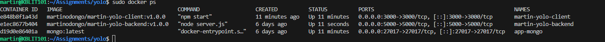
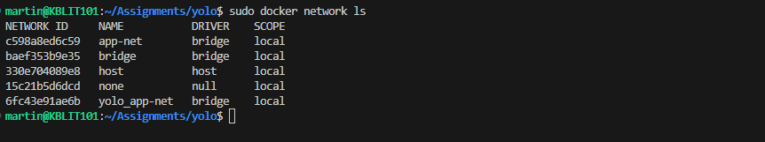
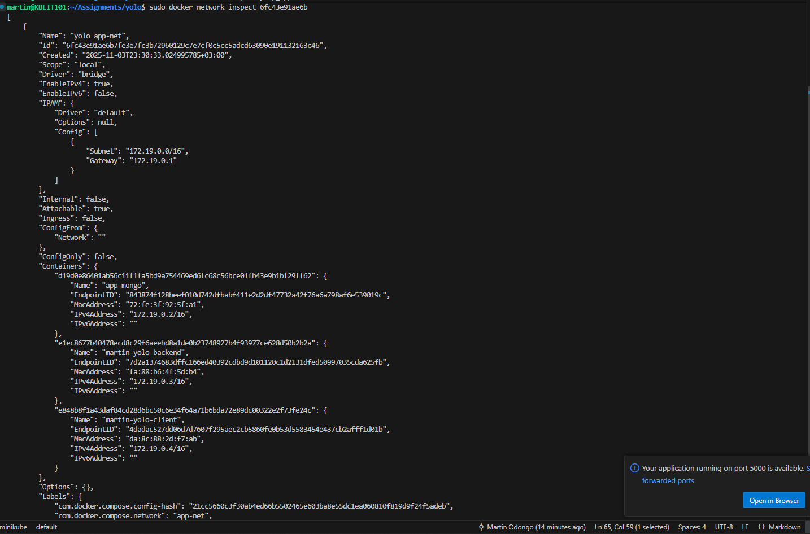
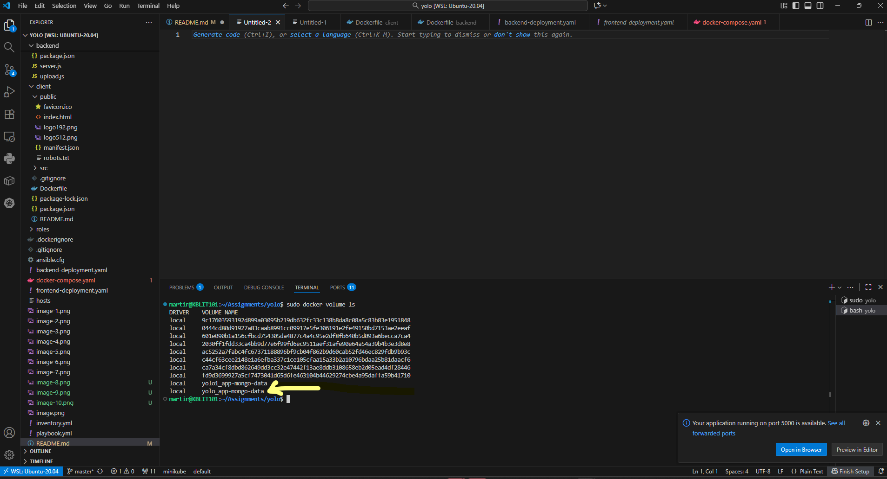
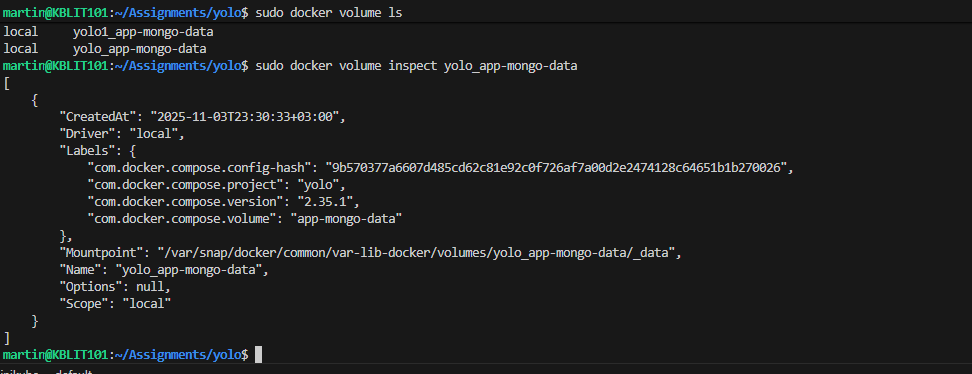
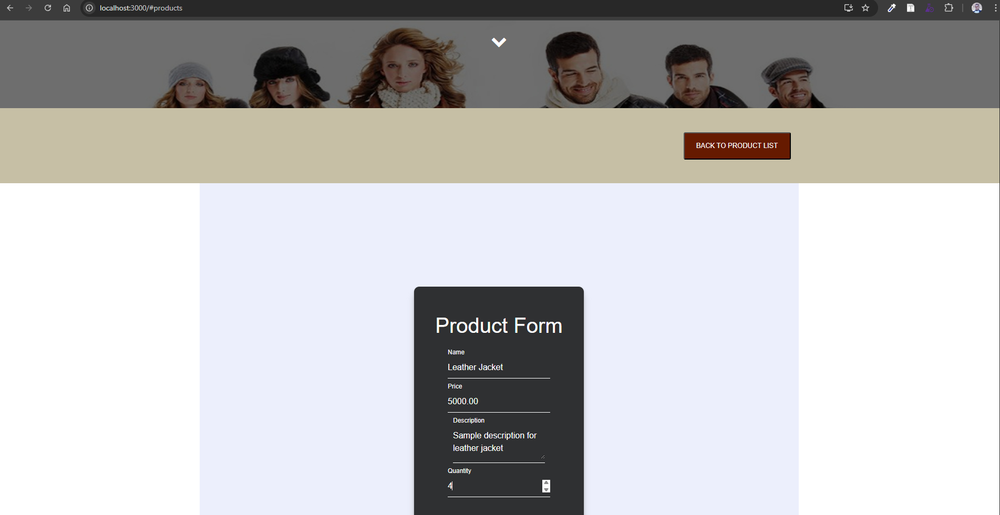
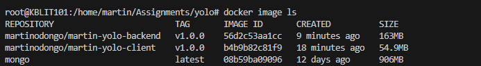
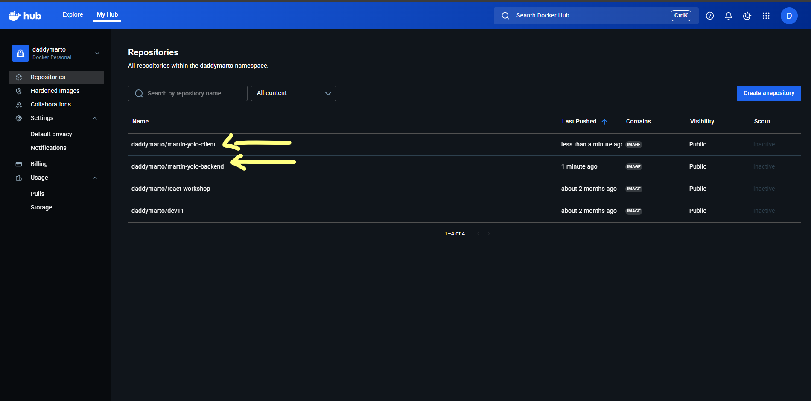

# Overview 
This repository contains a full-stack web application (frontend + backend) built with modern web technologies, orchestrated via Docker, and deployed using Vagrant + Ansible.  
The aim is to demonstrate a production-ready infrastructure workflow: development → containerisation → deployment.

# Requirements
Before starting the containerization, you need to install Docker. Docker consists of three main components: Docker Engine (the core runtime for building and running containers), Docker CLI (the command-line interface for interacting with Docker), and Docker Compose (a tool for defining and running multi-container applications, now integrated as a CLI plugin).

Install the docker engine here:
- [Docker](https://docs.docker.com/engine/install/) 
- Download Docker Desktop from https://www.docker.com/products/docker-desktop (includes Engine, CLI, and Compose plugin) for Windows/Mac.
- For Ubuntu/Linux: from terminal Run sudo apt update && sudo apt install docker-ce docker-ce-cli containerd.io docker-compose-plugin.
- Verify installation:from terminal Run docker version (checks Engine/CLI) and docker compose version (checks Compose).

Confirm the version on docker compose.
- Run docker compose version

# Key Features

- Frontend: Built with HTML, CSS and JavaScript (SPA or dynamic UI)  
- Backend: RESTful API (or server-side application) serving the frontend and data endpoints  
- Containerisation: Each service runs in its own Docker container  
- Infrastructure as Code:
  - `Vagrantfile` for provisioning local development VM 
  - `Ansible` playbook/inventory for configuration management  
  - `docker-compose.yaml` for orchestration  
  - Kubernetes (or YAML deployment) manifests for backend & frontend in production  
- Multi-service architecture with roles separation (see `roles/` folder)  
- Clean structure for both client & server, enabling independent development and CI/CD readiness  

## 📁 Repository Structure  

├── .vscode/ # VS Code settings
├── backend/ # Backend application code
├── client/ # Frontend application code
├── roles/ # Ansible roles (e.g., webserver, database)
├── docker-compose.yaml # Compose file for multi-container setup
├── frontend-deployment.yaml # Deployment manifest for frontend
├── backend-deployment.yaml # Deployment manifest for backend
├── Vagrantfile # Virtual machine definition for local dev
├── hosts # Inventory of servers
├── inventory.yml # Ansible inventory
├── playbook.yml # Ansible playbook
├── ansible.cfg # Ansible configuration
├── .dockerignore # Docker ignore file
├── .gitignore # Git ignore file
└── README.md # This file

## How to launch the application 
 - Check if any docker containers are running by running docker ps and docker ps -a to check previously launched but stopped containers.

 - Stop any unnecessary containers and then check again by running docker ps

- Now build your application by running command docker compose build on your terminal. This will install all dependancies including updating nuget package manager.
- Note, faster internet speeds up the building of the project.

- Launch application by running command docker compose up.
- The result will be as show below.

## Confirm that the application is up and running.
- Follow the link shown above http://localhost:3000 to launch the application. 

The above screen is a confirmation that application is running as expected. 
## Check and confirm that the containers are running and that the database (mongo db) is pulled.
- Run command docker ps to list the containers that are running a 

- The resuls are as show above.

## Volumes and Networks: Listing and Inspecting
### Network
Networks enable comms (same network for hostname resolution). List: docker network ls. Inspect: docker network inspect yolo-net (IPs, containers). We use same network for backend to reach mongo.
If logged in as sudo, you could list netwoks by running docker network ls command. If not, add the word sudo at the begining as shown below. 

This shows the networks available and yolo_app_net is our network.
- Copy the Network ID and run sudo docker network inspect to show details on the container network configuration. 

The results will be as shown above.

### Volumes
Volumes persist data. List: docker volume ls. Inspect: docker volume inspect yolo_app-mongo-data (mountpoint: /var/lib/docker/volumes/app-mongo-data/_data).
- Run docker volume ls or sudo docker volume ls to confirm our volume. 

Image above shows yolo_app-mondo-data as our volume. 

- To inspect our volume, copy the volume name and run sudo docker volume inspect yolo_app-mongo-data.

Image above shows volume inspection.

## Check Application and Persistence.

From the running portal(frontend) which is running on http://localhost:3000 , Add a test product. 

 

 ## Reduce Docker Image size
  - Build your images from node:20-alpine to reduce image size.
  - Remove unnecesary files to reduce image size. 
  - Update the .dockerignore file to add any unwanted files from being tagged to the docker. 

  

  Docker images should be less than 200MB 

  ## DockerHub Image Link

  https://hub.docker.com/repositories/daddymarto

  Back End: daddymarto/martin-yolo-backend:v1.0.0
  Front End: daddymarto/martin-yolo-client:v1.0.0

  

  # Modifying to Pull from Docker Hub Instead of Building Locally

After you have pushed your image to docker hub, you can use remote images from docker hub instead of local ones
To use remote images: Remove build: sections in docker-compose.yml, keep image:. It pulls from Hub.

E.G 
services:
  martin-yolo-client:
    image: daddymarto/martin-yolo-client:v1.0.0  # Pulls from Hub
    # No build:
    # ... rest

    martin-yolo-backend:
    image: daddymarto/martin-yolo-backend:v1.0.0  # Pulls from Hub
    # No build:
    # ... rest
 