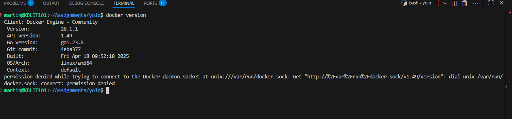

# Overview 
This repository contains a full-stack web application (frontend + backend) built with modern web technologies, orchestrated via Docker, and deployed using Vagrant + Ansible.  
The aim is to demonstrate a production-ready infrastructure workflow: development → containerisation → deployment.

# Requirements
Before starting the containerization, you need to install Docker. Docker consists of three main components: Docker Engine (the core runtime for building and running containers), Docker CLI (the command-line interface for interacting with Docker), and Docker Compose (a tool for defining and running multi-container applications, now integrated as a CLI plugin).

Install the docker engine here:
- [Docker](https://docs.docker.com/engine/install/) 
- Download Docker Desktop from https://www.docker.com/products/docker-desktop (includes Engine, CLI, and Compose plugin) for Windows/Mac.
- For Ubuntu/Linux: from terminal Run sudo apt update && sudo apt install docker-ce docker-ce-cli containerd.io docker-compose-plugin.
- Verify installation:from terminal Run docker version (checks Engine/CLI) and docker compose version (checks Compose).

# Key Features

- Frontend: Built with HTML, CSS and JavaScript (SPA or dynamic UI)  
- Backend: RESTful API (or server-side application) serving the frontend and data endpoints  
- Containerisation: Each service runs in its own Docker container  
- Infrastructure as Code:
  - `Vagrantfile` for provisioning local development VM 
  - `Ansible` playbook/inventory for configuration management  
  - `docker-compose.yaml` for orchestration  
  - Kubernetes (or YAML deployment) manifests for backend & frontend in production  
- Multi-service architecture with roles separation (see `roles/` folder)  
- Clean structure for both client & server, enabling independent development and CI/CD readiness  

## 📁 Repository Structure  
/
├── .vscode/ # VS Code settings
├── backend/ # Backend application code
├── client/ # Frontend application code
├── roles/ # Ansible roles (e.g., webserver, database)
├── docker-compose.yaml # Compose file for multi-container setup
├── frontend-deployment.yaml # Deployment manifest for frontend
├── backend-deployment.yaml # Deployment manifest for backend
├── Vagrantfile # Virtual machine definition for local dev
├── hosts # Inventory of servers
├── inventory.yml # Ansible inventory
├── playbook.yml # Ansible playbook
├── ansible.cfg # Ansible configuration
├── .dockerignore # Docker ignore file
├── .gitignore # Git ignore file
└── README.md # This file
## How to launch the application 
 

## How to run the app
Use vagrant up --provison command
